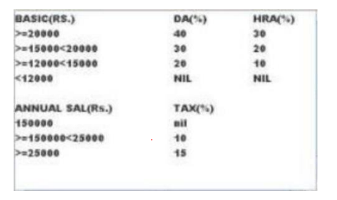

### Calculate Salary

The [demonstration](https://youtu.be/oSOV2TNBLG0) of the calculate salary application.

A Company Calculator which take the employee name and his basic salary then calculate the DA, HRA & the Tax if:

There will be an exception if the user entered letters in the basic salary as a Message is going to appear which ask the user to enter numbers only and clear the basic salary so that he enters again:

